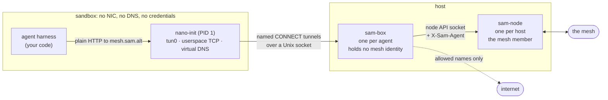

{}
The sandbox works end to end and is exercised in CI, but `sam-box` flags,
the bundle format and `nano-init`'s options may change between releases.
{}

An agent is a harness, a model and some tools. To deploy one you normally
ship all three, plus a key for the model, plus network access that is wide
enough for whatever the tools turn out to need. On SAM you ship only the
harness. The mesh provides the model and the tools by name, and the network
the agent gets is a list of names that is checked on every connection.

The agent holds no credential. There is no API key, mesh token or service
account file in the sandbox, and no proxy variable. An agent that holds a
key can leak it, and an agent that can be talked into leaking a key will
eventually do so.

## The pieces



**`nano-init`** is PID 1 inside the sandbox. It creates a `tun0` device,
makes it the default route, and terminates the sandbox's TCP/IP in userspace
(gVisor's netstack, through the `tun2connect` library). For each connection
the agent opens, it opens one named HTTP tunnel to the boundary:
`CONNECT host:port` for TCP and `connect-udp` for UDP. Its virtual DNS
answers every lookup with a synthetic address (from `100.64.0.0/10` or
`100::/64`) and remembers the pairing, so the tunnel carries the name that
the agent asked for. An address that the agent never resolved has no name
and is refused. `nano-init` also reaps orphan processes and forwards
signals. It lives in its own Go module, because a userspace network stack
does not belong in the dependency graph of the other binaries.

**`sam-box`** is the boundary. There is one per agent, on the host side of
the Unix socket. It has no libp2p host, no enrollment and no mesh identity.
It is a client of the local `sam-node`'s API socket. For each tunnel it
classifies the name and decides:

| Name | Decision |
|---|---|
| `mesh.sam.alt` | The mesh surface: `/v1/models`, `/v1/chat/completions`, `/v1/completions`, `/mcp`. Any other path is `403`. |
| `<service>.<type>.sam.alt` | One specific mesh service, `<type>` being `mcp`, `inference` or `a2a`: `code-reviewer.mcp.sam.alt`, `openrouter.inference.sam.alt`. Discovery chooses the provider. |
| anything else | Matched against the agent's egress allowance. A name that is not in the allowance is refused. |

A refusal fails the `CONNECT` with `403` and a `Boundary-Reason` header. The
sandbox's network stack turns this into an ordinary connection reset. The
agent sees a refused connection. The operator sees the reason in the
boundary's log and metrics.

**`sam-node`** is unchanged. It is the mesh member, one per host, and it
holds the identity. Adding an agent costs one `sam-box`, and no new
enrollment or new peer in the DHT.

The split matters because reaching the node's API socket is itself a
credential. The socket cannot register services (they are static), but it
can call anything that the node's grants allow. So the agent never touches
the socket. `sam-box` uses the node on the agent's behalf and offers the
agent a narrower surface.

## What the agent sees

```python
client = AsyncOpenAI(base_url="http://mesh.sam.alt/v1", api_key="unused")

async with streamable_http_client("http://mesh.sam.alt/mcp") as (read, write):
    async with ClientSession(read, write) as session:
        await session.initialize()
        tools = await session.list_tools()
```

These are ordinary SDK clients with nothing SAM-specific in them. The
`api_key` is a placeholder that the SDK requires. The agent does not know
which peer serves the model and cannot find out. Two agents behind the same
node can see different tool lists, because the mesh answers according to who
is asking. A refused tool call comes back as an error that the model can
read, not as a crash.

## Identity is asserted about the agent, not by the agent

`sam-box` reads a **bundle** that the platform writes outside the sandbox:

```yaml
version: v1
agent:
  id: researcher-1.prod.acme.example
  external_id: system:serviceaccount:agents:researcher
egress:
  allow:
    - api.github.com
    - "*.githubusercontent.com"
serves:
  name: code-reviewer
  port: 8080
```

Writing that file is not enough to become that agent. `sam-box` verifies a
platform credential (`--credential-issuer`, `--credential-audience`; on
Kubernetes this is a projected service account token) and accepts the bundle
only if the subject of the credential matches `external_id`. On every
request it then names the agent to the node in the `X-Sam-Agent` header,
replacing anything that the sandbox tried to set. The destination node
accepts that name only if the calling node's credential grants the namespace
through the role's `allowed_agents`. A node granted `*.c1.acme.example`
cannot speak for `researcher-1.prod.acme.example`. The namespace belongs to
the node and the identifier belongs to the agent. This is why an agent keeps
its name when it is paused on one host and resumed on another.

Wildcard egress entries match subdomains only: `*.pypi.org` matches
`files.pypi.org`, but not `pypi.org` and not `evilpypi.org`. Matching uses
the name that the agent asked for, never a resolved address.

The issuer is a flag and not a bundle field on purpose. The bundle travels
with the agent, so an issuer named inside it could be one that an attacker
controls.

## Running it

The example harness in
[`development/examples/agent-harness`](https://github.com/google/sam/tree/main/development/examples/agent-harness)
is about a hundred lines. It discovers tools, calls a model, runs the tool
loop, and stops.

Start a node that serves its API on a socket:

```bash
sam-node run --socket-path /run/sam/node.sock --data-dir /var/lib/sam --bind-addr=
```

Start a boundary for the agent:

```bash
sam-box run \
  --socket /run/sam/agent.sock \
  --sidecar-socket /run/sam/node.sock \
  --bundle ./bundle.yaml \
  --credential-issuer https://kubernetes.default.svc \
  --credential-audience sam \
  --metrics-addr 127.0.0.1:9600
```

On a laptop without a platform issuer, `--insecure-unverified-bundle` skips
the credential check. It logs what this means: whoever can write the bundle
decides which agent the sandbox is. This is a flag that shows in a process
listing, so the choice is visible.

Start the sandbox as a container:

```bash
docker run --rm \
  --network none \
  --cap-add NET_ADMIN --device /dev/net/tun \
  -v /run/sam/agent.sock:/run/agent.sock \
  agent-harness "Summarise the open issues in our repo"
```

`--network none` is what makes this a sandbox. `NET_ADMIN` and
`/dev/net/tun` are needed only so that `nano-init` can create the single
`tun0`. The image's entrypoint is `nano-init run /run/agent.sock <command>`.
`nano-init copy <dest>` copies the binary into an image that contains
nothing else.

Look at what happened:

```console
$ curl -s http://127.0.0.1:9600/metrics | grep sam_box_flows_total
sam_box_flows_total{outcome="allowed",route="external"} 1
sam_box_flows_total{outcome="allowed",route="mesh-entrypoint"} 19
sam_box_flows_total{outcome="denied",route="unresolved"} 1
```

Refusals do not show up as latency, so counting them is the only way to see
them. If you edit the bundle and restart `sam-box`, these numbers change
without any change to the agent.

## Sandbox types

The layers are the same in all three types. Only the way the sandbox reaches
the socket differs.

**Container with `--network none`.** The socket is bind-mounted into the
container. This is the setup shown above.

**Firecracker microVM.** Each agent gets its own kernel, which boots in a
few tens of milliseconds. The guest has no network device. `nano-init`
reaches the boundary over vsock (`vsock://2:1080`). Firecracker terminates
guest vsock connections on the host as `<uds_path>_<port>`, so for a guest
that dials CID 2 port 1080, `sam-box --socket` must serve exactly
`/var/run/sam-vm-1.vsock_1080`. The host never speaks `AF_VSOCK`, and this
is why the same `sam-box` serves containers and VMs. The guest kernel must
have `CONFIG_TUN=y`. The stock Firecracker CI kernels for 5.10 and 6.1 do
not have it. The 6.18 kernel does.

**Kubernetes pod.** The containers in a pod share one network namespace and
one `resolv.conf`, so there is no per-container `--network none`.
`nano-init run --create-namespaces` builds its own namespaces. It first
creates a user namespace, in which it holds `CAP_SYS_ADMIN` and
`CAP_NET_ADMIN` over what it creates next, and then a network namespace that
contains only `tun0`. The container itself needs no capability.

```yaml
apiVersion: v1
kind: Pod
metadata:
  name: agent
spec:
  volumes:
    - { name: sam-uds, emptyDir: {} }
    - { name: tun, hostPath: { path: /dev/net/tun, type: CharDevice } }
    - { name: resolv, configMap: { name: sandbox-resolv } }
  containers:
    - name: sam-node
      image: ghcr.io/google/sam-node:latest
      args: [run, --jwt-path=/var/run/secrets/tokens/sam-token, --bind-addr=, --socket-path=/var/run/sam/node.sock]
      volumeMounts: [{ name: sam-uds, mountPath: /var/run/sam }]
    - name: sam-box
      image: ghcr.io/google/sam-box:latest
      args: [run, --socket=/var/run/sam/agent.sock, --sidecar-socket=/var/run/sam/node.sock, --egress-allow=api.github.com]
      volumeMounts: [{ name: sam-uds, mountPath: /var/run/sam }]
    - name: agent
      image: your-agent-image
      command: [/usr/local/bin/nano-init, run, --create-namespaces, /var/run/sam/agent.sock, python3, /app/agent.py]
      volumeMounts:
        - { name: sam-uds, mountPath: /var/run/sam }
        - { name: tun, mountPath: /dev/net/tun }
        - { name: resolv, mountPath: /etc/resolv.conf, subPath: resolv.conf }
---
apiVersion: v1
kind: ConfigMap
metadata:
  name: sandbox-resolv
data:
  resolv.conf: "nameserver 100.127.255.253\n"
```

Three details are easy to get wrong without any error message:

- **The TUN device is only a `hostPath` mount.** The device cgroup does not
  deny `/dev/net/tun`. What is gated is the `TUNSETIFF` call, and that is a
  capability question that the user namespace answers.
- **No `securityContext`.** Granting `CAP_SYS_ADMIN` alone is worse than
  granting nothing. The namespace gets created, and then the tun fails
  because `CAP_NET_ADMIN` is missing.
- **The sandbox's `resolv.conf` is mounted per container.** `dnsConfig` is a
  pod-level field. It would point `sam-node` at a resolver that exists only
  inside the sandbox's namespace. With the file mounted, `nano-init` finds
  its resolver already configured and needs no bind mount. The bind mount is
  the one operation that containerd's default AppArmor profile denies.

The harness must be a child process of `nano-init`. The `command` above
arranges this. A container that starts the harness directly, or that runs
`nano-init` next to it, leaves the harness in the pod's network namespace,
with `eth0` and every route. It will run, and it will not be sandboxed.
Check:

```console
$ kubectl exec -c agent agent -- ip -o link show | cut -d: -f2
 lo
 tun0
```

Ubuntu 24.04 hosts set `kernel.apparmor_restrict_unprivileged_userns=1`.
This confines an unprivileged process that creates a user namespace to a
profile that denies every capability, and the tun then fails with
`operation not permitted`. Managed clusters apply their own AppArmor profile
and are not affected. A kind cluster on such a host needs the sysctl set to
`0`.

## Agents that serve

An agent can serve one thing: itself, as an A2A agent. Tools and models are
operator workloads declared in a node's configuration. An agent never
advertises one. The whole route is fixed before the agent runs, and nothing
is registered at run time:

- The bundle's `serves` names the service and the port that the agent must
  bind, in the same way `$PORT` works on a serverless runtime. `sam-box`
  routes that name to that port from startup. A name outside the contract
  cannot be expressed.
- The node's configuration declares the service with `type: a2a` and a
  `target_url` that points at the boundary's ingress listener
  (`--ingress-listen`, default `127.0.0.1:7080`).
- The node probes the agent's card through the boundary before it
  advertises the service, and it keeps probing. An agent that has not bound
  its port yet, or that has died, is not discoverable. When it answers, it
  is. Readiness is observed, never assumed. When the boundary stops, the
  probe fails and discovery converges.

Delivering a request into the sandbox cannot mean dialling the agent. The
agent's `127.0.0.1` is inside a namespace that the boundary is not in. So a
second Unix socket carries each inbound request to the contracted port.
`nano-init --ingress-socket` serves it from inside the sandbox, and
`sam-box --agent-ingress-socket` dials it. That flag is required whenever a
bundle has `serves`, and `sam-box` refuses to start without it. The only
other address available would be one in the boundary's own namespace, which
in a pod is the pod's namespace, where the node's API is listening. The
agent's node authorized the caller before the request reached the boundary,
so "agent `foo` may call agent `bar`" is one policy statement, evaluated at
the node of `bar`.

## Not yet built

- **Secret injection** for external destinations. The machinery exists
  (an ephemeral CA, header rewriting) but is not connected to this datapath.
- **Credential rotation.** The bundle's credential is verified when
  `sam-box` starts. Verifying it again when a platform rotates a projected
  token is the `Refresh` operation of the connector interface, which does
  not exist yet.
- **The connector control socket** (`Attach`, `Detach`, `Refresh`,
  `Status`), through which a scheduler would drive `sam-box`. Today the
  bundle is a file, and the lifecycle of the boundary is the lifecycle of
  the process.

## `sam-box run` flags

| Flag | Meaning |
|---|---|
| `--socket` | The sandbox-facing Unix socket, created with mode `0600`. Required. |
| `--sidecar-socket` | The local `sam-node` API socket. Required. |
| `--bundle` | The agent bundle. |
| `--credential-issuer`, `--credential-audience` | The issuer and audience of the platform credential that must back the bundle. Required with `--bundle`. |
| `--insecure-unverified-bundle` | Trust the bundle without a credential. |
| `--egress-allow` | Destination names that an unidentified sandbox may reach. Repeatable. Use the bundle instead when the agent has an identity. If empty, nothing outside the mesh is reachable. |
| `--agent-ingress-socket` | The reverse channel into the sandbox. Required when the bundle has `serves`. |
| `--ingress-listen` | Address on which the boundary's mesh-facing ingress listens. Default `127.0.0.1:7080`. The node's `a2a` service declaration points here. |
| `--metrics-addr` | Prometheus metrics (`sam_box_*`) without authentication. Off by default. |
| `--log-level` | `debug`, `info`, `warn`, `error`. |

## Further reading

- [Agent architecture](../agent-architecture/): the decisions behind this
  design and the reasons for them.
- [Scale report](../scale-report/): the measured cost of a boundary.
- [Authorization](../../concepts/authorization/#agents-acting-through-a-node):
  how `allowed_agents` and the `agent` claim are evaluated.
